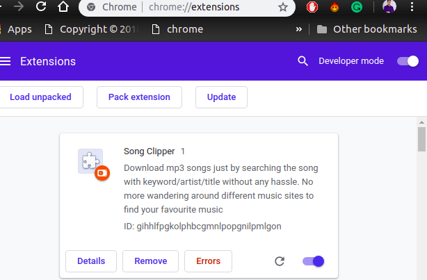

# SongClipper

SongClipper is an application that extracts audio files from video streaming sites (only YouTube in `v1.0.0`) and downloads the mp3 files.

## Getting started

There are 3 interfaces in the application

* Command line interface

* REST API

* Frontend with google chrome extension

### Command line interface

This component can be independently used to search and download audio files.

### Quick start

```
pip install -r requirements.txt
python main.py

```

### REST API

This component is used as backend for frontend chrome extension.

### Quick start

```
pip install -r requirements.txt
python api/app.py

```

### Google chrome extension

An interface for users to search and download audio files.

### Quick start

* Visit `chrome://extensions` in your browser and ensure that the Developer mode checkbox in the top right-hand corner is checked.

* Click Load unpacked extension and select the directory in which your extension files live. If the extension is valid, you will see the details of the
extension as shown in the image along with a new application icon on the address bar.



